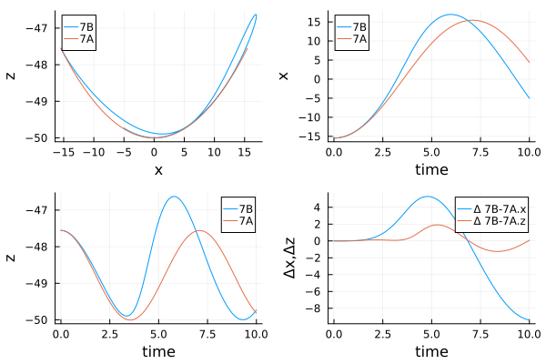
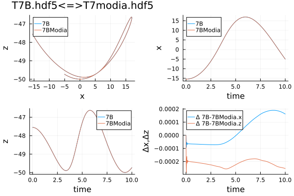
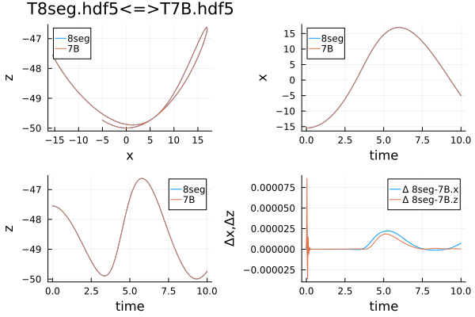

# TestTether.jl


Testing different approaches for tether chain models.

The following 4 models are considered

* `Tether_07A.jl` - the original (monolithic) version using MTK ecosystem - only the calculation of cross-section was corrected.
* `Tether_07B.jl` - a modified version (see [PR](https://github.com/ufechner7/Tethers.jl/pull/5))
* `T7modia.jl` - a Modia3D implementation - only for verification
* `Tether_08.jl` - an element based model - including friction in air and the impact of wind

## Installation

It's assumed that the `ModelingToolkit` ecosystem is already installed.

It's recommended to use the latest versions from `Modia` and `Modia3D`

> ```julia
>using Pkg
>Pkg.add("https://github.com/ModiaSim/Modia.jl.git")
>Pkg.add("https://github.com/ModiaSim/Modia3D.jl.git")
>Pkg.add("Plots")
>Pkg.add("JLD2")
>```

## Models
Do make it easier to compare, the original model was simplified.

The reel-out speed was set to zero. `v_ro = 0.0   # reel-out speed  [m/s]`, so the model was reduced to a multi-element pendulum. All other parameters remain unchanged. The results of the simulation (position of the last particle) is stored in a `JLD2` structure for post-processing.

### `Tether_07A.jl`

The original model with modified cross-section calculation.

This code (line #76) seems not to be correct.   `acc = force / mass`

`eqs2 = vcat(eqs2, acc[:, i+1] .~ se.g_earth + total_force[:, i] / 0.5*(m_tether_particle))`

### `Tether_07B.jl`

The modified model (see [PR](https://github.com/ufechner7/Tethers.jl/pull/5)) with the assumption that the mass of the segment is located at the end. Elongation was considered in the model.

### `T7modia.jl`

For this model the same approach was used.

Main difference to the MTK implementation:

* Elongation is ignored
* Revolution damping was considered

### `Tether_08.jl`


## performed Tests

For all 4 models tests procedures are defined. The position of the last segment is stored in a `JLD2` structure.

| model name | test routine| result HDF5|
|:----|:----|:---|
| Tether_07A.jl | `runTest7A.jl` | `T7A.hdf5` |
| Tether_07B.jl | `runTest7B.jl` | `T7B.hdf5` |
| T7modia.jl | `runT7modia.jl` | `T7modia.hdf5` |
| Tether_08.jl | `runTest8.jl` | `T8seg.hdf5` |


#### Running `compareResults.jl` the results of the performed simulation can be shown in diagrams.

```
julia> include("compareResults.jl")
[press: Enter=toggle, a=all, n=none, d=done, q=abort]
→ ⬚ T7A.hdf5
  ⬚ T7B.hdf5
  ⬚ T7modia.hdf5
  ⬚ T8seg.hdf5
```


### comparison: `Tether_07A.jl - Tether_07B.jl`

The original implementation was compared with the modified MTK model. Result are shown below.



### comparison: `Tether_07B.jl - T7modia.jl`

The modified MTK model was compared with a `Modia3D` implementation. Result are shown below. The results are more or less identical.



### comparison: `Tether_07B.jl - Tether_08.jl`

Comparison of the monolithic model `Tether_07B.jl` with teh element based model `Tether_08.jl`. The results are identical.




## Discussion & TODO's


### rotational damping

Implementing rotational damping in `MTK` seems to be very difficult. To obtain correct results, torques and inertia of the masses must be taken into account. A correct implementation can be found in `Modia3D`.

Taking into account the air friction of the tether leads to more realistic results. The parameters used in the first draft of `Tether_08.jl` should be reviewed.


### roll-in roll-out


Variation of length of a segment results in changing of the mass of the element.  

Basically:

```
force  = der(impulse)
impulse = mass x speed
force = mass x der(speed) + speed x der(mass)
```

The impact of the additional dynamic force due to changing of the length of the tether should be studied.