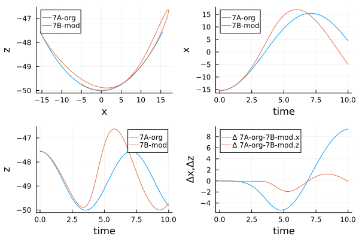
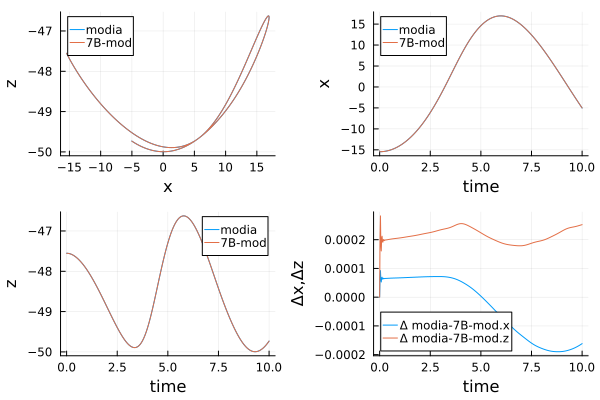

# TestTether.jl


Testing different approaches for tether chain models.

The following 3 models are considered

* `Tether_07A.jl` - the original version using MTK ecosystem - only the calculation of cross-section was corrected.
* `Tether_07B.jl` - a modified version (see [PR](https://github.com/ufechner7/Tethers.jl/pull/5))
* `T7modia.jl` - a Modia3D implementation - only for verification


## Installation

It's assumed that the `ModelingToolkit` ecosystem is already installed.

It's recommended to use the latest versions from `Modia` and `Modia3D`

> ```julia
>using Pkg
>Pkg.add("https://github.com/ModiaSim/Modia.jl.git")
>Pkg.add("https://github.com/ModiaSim/Modia3D.jl.git")
>Pkg.add("Plots")
>Pkg.add("JLD2")
>```

## Models
Do make it easier to compare, the original model was simplified.

The reel-out speed was set to zero. `v_ro = 0.0   # reel-out speed  [m/s]`, so the model was reduced to a multi-element pendulum. All other parameters remain unchanged. The results of the simulation (position of the last particle) is stored in a `JLD2` structure for post-processing.

### `Tether_07A.jl`

The original model with modified cross-section calculation.

This code (line #76) seems not to be correct.   `acc = force / mass`

`eqs2 = vcat(eqs2, acc[:, i+1] .~ se.g_earth + total_force[:, i] / 0.5*(m_tether_particle))`

### `Tether_07B.jl`

The modified model (see [PR](https://github.com/ufechner7/Tethers.jl/pull/5)) with the assumption that the mass of the segment is located at the end. Elongation was considered in the model.

### `T7modia.jl`

For this model the same approach was used.

Main difference to the MTK implementation:

* Elongation is ignored
* Revolution damping was considered


## performed Tests

For all 3 models tests procedures are defined. The position of the last segment is stored in a `JLD2` structure.

| model name | test routine| result JLD2|
|:----|:----|:---|
|Tether_07A.jl| `runTest7A.jl`| `T7A.jld2` |
|Tether_07B.jl| `runTest7B.jl`| `T7B.jld2` |
|T7modia.jl| `runT7modia.jl`| `T7modia.jld2` |


## Discussion

### comparison: `Tether_07A.jl - Tether_07B.jl`

The original implementation was compared with the modified MTK model. Result are shown below.



### comparison: `Tether_07B.jl - T7modia.jl`

The modified MTK model was compared with a `Modia3D` implementation. Result are shown below. The results are more or less identical.



